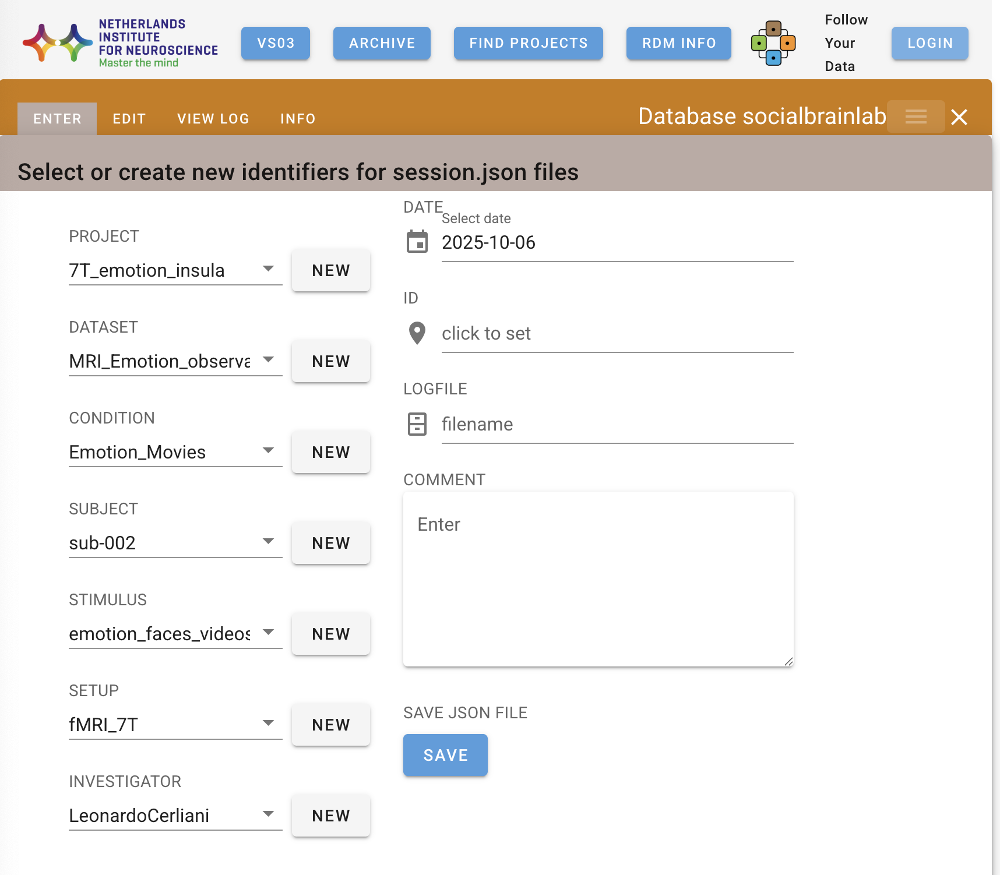

# FYD 4 SBL

# Main idea
In order to use FYD, every single information, starting from the project all the way to the subject ID, must be pre-registered in the database (db).

Also important: every subject ID must be _unique_ across projects for the same lab (!)

However, what needs to be registered manually are only the following *mandatory* fields:

- project
- dataset
- condition
- stimulus
- setup
- investigator

The main issue is the number of subjects, which can be in the hundreds, however it is possible to register them programmatically in python using `datajoint`. 

Once the subjects are registered, we just need to place the json with the appropriate information in the correct place, and the rest will happen by itself. The good news is that we can also easily generate the json files automatically in a script.

Admittedly this is already quite complex, but if we keep things simple, it can be done in an acceptable way.

The main idea for the procedure is the following:

1. Choose a simple organization for your raw data folders (e.g. see below)

2. Create a text file with a list of all you subject IDs

3. Go to [FYD](https://nhi-fyd.nin.nl/), create your new project and register the required information (the ones listed above)

4. Feed the text file with the list of subjects ID into a first notebook that will generate the json files based on a template (that you will define)

5. Copy the files in the appropriate folders

6. Use the second notebook to register the subjects on FYD


# Access

In order to access FYD you need to be connected via ethernet to the NIN network. The connection with other wifi is also possible (e.g. eduroam).

FYD https://nhi-fyd.nin.nl/

uname is your NIN uname (e.g. cerliani) and pw is the one used for Microsoft


# Procedure to create the json files and register them in the FYD db


## Create a python venv

We will need to use python both for creating the json files and to register them in the FYD db. Since we will be using jupyter notebooks, we also need the libraries for that.

```python
python -m venv venv_FYD
source vevn_FYD/bin/activate
pip install -r requirements.txt
# These are basically the libraries that the requirements.txt will install
# pip install pandas numpy jupyter "notebook<7.0.0" datajoint itables
```


## Choose a simple organization of the raw files

```bash
/data01/7T_Emotion_Insula/Data_collection/raw_data

├── sub-02
├── sub-03
...
├── sub-34

```

Of course inside the sub folders you can have as many subfolders you want (e.g. for sessions). The idea is to have _only one json for each subject_, so the level-1 organization is all we will care about for the FYD.

The unicity of the subject ID will be determined by the association of the sub-nnn and the project name, for instance, we will generate json files named:

```
sub-02_7T_Emotion_Insula_session.json
sub-03_7T_Emotion_Insula_session.json
...
sub-34_7T_Emotion_Insula_session.json
```

Note: the directory names and the names of the files inside the directories are _independent_ from the subject ID we will place in the `_session.json`. The latter is only for FYD, and our only concern is that it is unique across all the projects of our lab (that is the requirement and I cannot do anything about that)


## Create a `list_subj.txt` file

This is very simple from the terminal. For instance in the case of the structure of directories above, it is as simple as doing

```bash
ls -d sub* > list_subj.txt
```

This is the file that we will feed into the script to generate the json files according to the template.


## Register the new project on FYD and the mandatory fields

At this point you should head to https://nhi-fyd.nin.nl/, create a new project and fill in *only once* all the fields that you will keep stable across subjects. Everything explained below works for the case in which all the mandatory fields (see above) always remain the same, and the only field that changes is the subject field.

**IMPORTANTLY, ONCE REGISTERED, THESE VALUES SHOULD NOT BE CHANGED, SO CHOOSE THEM WISELY.**

Note that you also need to register one subject. You can give a temporary name and remove it later.

Below you can see an example




## Fill in a json template

Once you have registered all the fields that will not change, you build a template for the json files using exactly the same field names you just registered. Make sure you do not make typos here!

```python
json_template = {
    "project": "7T_emotion_insula",
    "dataset": "MRI_Emotion_observation",
    "condition": "Emotion_Movies",
    "subject": "SUB_ID",
    "stimulus": "emotion_faces_videos",
    "setup": "fMRI_7T",
    "investigator": "LeonardoCerliani",
    "date": "2024-01-01",
    "version": "1.0",
    "logfile": "",
    "comment": ""
}
```


The only field that should not be entered manually is of course the "subject", for which here I just put a placeholder. Note that to make the SUB_ID unique, we will replace it not just with the content of one line of the `list_subjects.txt` , but also with a `project_label` variable inside the notebook, in order to ensure the unicity of the subject name across all the projects in the lab.


## Generate the json files

You should now open and adapt the `generate_jsons.ipynb` notebook according to your needs.

Make sure that 

- you have the correct project label
- the json template reflects the fields you registered online
- the `list_subj.txt` has exclusively the following content: one user ID in each row.


Next, the `generate_jsons.ipynb` will generate **spaceless** jsons using 

- the information contained in the json template
- the subj_list.txt


Note that when the json file has been generated, you will still have to place it in the appropriate subject directory for each subject. I strongly recommend you to use a simple bash command for that. 


## Registering the subjct-IDs on FYD
This is something that can be done programmatically using `datajoint`. An example - provided by Chris vdT - is in the `InsertSubject_Chrisvdt.ipynb`. Other information (the classes for other tables) can be found on the [github of the FYD Python client](https://github.com/Herseninstituut/FYD_Python/blob/main/DJ/examplelab.ipynb). I also placed here the same notebook `examplelab.ipynb` for simplicity

Important things to note from the procedure of registering new subjects:

### There are classes for all the tables we need to access to
Specifically, for `Subjects` - where we will insert the actual subject ids - and for `Projects`. The latter is necessary because in the `Subjects` table we have a `projectidx`, however to know what is the `projectidx` of our projects - where we want to register new subjects - we need to look into the `Projects` table.


### Subjects can also be deleted from here
Look in the last cell


